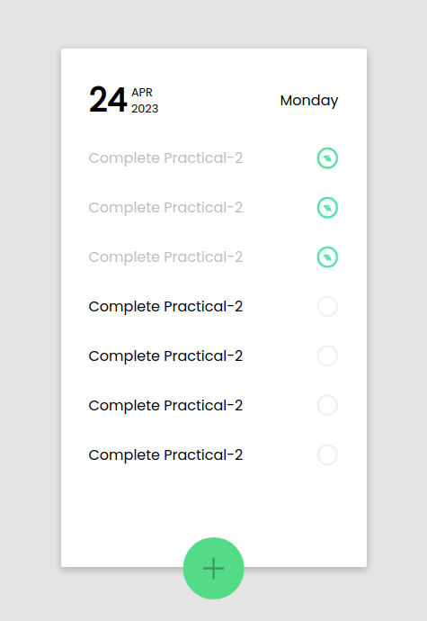

# TodoList-UI

### Live Link 
- just UI(practical-2) :[https://coruscating-halva-d17dc4.netlify.app/](https://coruscating-halva-d17dc4.netlify.app/)
- with functionality (practical-3):[https://delightful-madeleine-a6bd53.netlify.app/](https://delightful-madeleine-a6bd53.netlify.app/)

### Intoduction
 - UI of TodoList is created using React.
 - Used Class component,Function Component,Pure Function,Stateless Component.
 - Segregated CSS module files based on components.

### UI of TodoList

### Git Strategy
- There are four Branches 
    - main
    - dev
    - feature/UI
    - feature/refactor

- feature branches will be merged into dev.
- dev will be merged into main.

### Folder Structure

        client/src
        ├── App.css
        ├── App.jsx
        ├── Assets
        │   ├── checkedTask.png
        │   ├── favicon.ico
        │   └── uncheckedTask.png
        ├── Components
        │   ├── AddTodo
        │   │   ├── AddTodo.jsx
        │   │   └── AddTodo.module.css
        │   ├── DateHeader
        │   │   ├── DateHeader.jsx
        │   │   └── DateHeader.module.css
        │   ├── Task
        │   │   ├── CheckedTask.jsx
        │   │   ├── Task.module.css
        │   │   └── UncheckedTask.jsx
        │   └── TodoList
        │       ├── TodoList.jsx
        │       └── TodoList.module.css
        └── main.jsx        

- All the components are in src/Components and their respective folders.
- Style modules are included in the same folder of component.